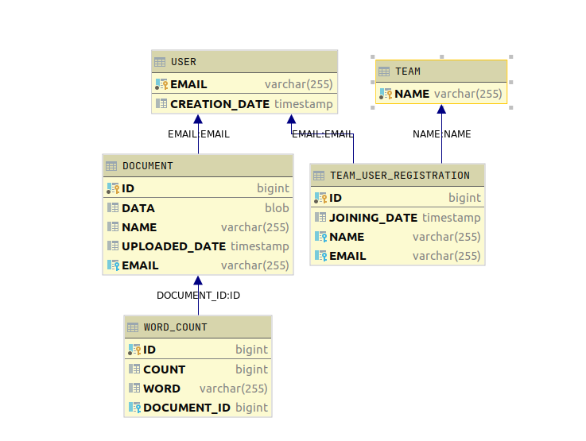
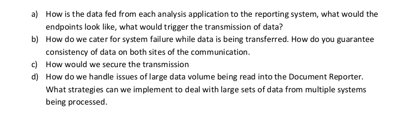

# Demo Document Tracking API


## Approach

#### Database schema
When I first read the document, I thought about creating maybe a snowflake schema, but I didn't over complicat the demo. So I made this
super simple schema design.


#### The app arch

Basically it's a layered app composed by Controllers -> Service -> Repository components.

- All persistente is based in JpaRepository (Spring Data JPA).
- All controllers are RestControllers.
- Services basically manages all business logic and exceptions.

It should be easy to understand the code. I really love Java 8 features (like Optionals, Stream  API...). I'm sure you'll notice it! :P
## How to run it

The app will create the database with the schema and data once launched. Just run it on your favourite IDE or with Maven (I'll attach the maven command below).

You can see the data used in [data.sql](./src/main/resources/data.sql) in the resources path. If you want to use your custom data, just make sure to comment the property
`initialization-mode: always`   (or set it to `none`) in the [application.yml](./src/main/resources/application.yml) file.

```shell script
mvn spring-boot:run
```

Once you run it, you can easily test it on your localhost just by clicking [here](http://localhost:8080/doc-tracker/api/v1/swagger-ui.html)

## Tech stack dependencies

Here a quick list of some interesting libs I have used for this demo:

- [Mockito](https://site.mockito.org/): In order to mock components easily!
- [Lombok](https://projectlombok.org/): It provides an easy way to create Builder patterns, and also reduce code
- [SpringFox](https://springfox.github.io/springfox/): All API documentation has been created thanks to its annotations!
- [H2](https://www.h2database.com/html/main.html): In memory database for this little demo!
- [Podam factory](https://mtedone.github.io/podam/): It provides an easy way to generate mock data for a given class!


## Self criticism

#### My english grammar

Mandatory to apologize about it! :p

#### Maybe not enougth tests!

I haven't tested the controller layer. I think it's quite obvious what it does 
(returning data and that's all!).

I tested the utils package and the service layer, because it's where we can see all the app real logic.

#### Methods too large!

Some of my methods are a bit large, and I would separate them into smaller pieces. But I think tight now
it's kinf of readible (yet!).

#### Wrapping the Repository components

I would wrap all repository methods (all the findBy methods you can see over my code) under a repository implementation
but I didn't want to add more complexity to the demo. But I think it would be easier to test some parts of the service layer
if we could mock all repository implementations output data.

#### Separing domains

I should create a domain for Teams, another one for Users, and other for Documents. But I made everything in the same controller.
I know it's not a good idea, but hope you don't kill me for it :p

### Cacheable GET endopoints with @Cacheable and caffeine
I think I could cache some GET endpoints in order to make the app fater.

### Data validation with @Valid
Not so many validations. Only the basic ones.

### Improved Controller Exception Handler
There's a basic handler with custom business logic exceptions. It would be nice to center all exceptions handlers
(IllegalArgumentExceptions and so on) here, but this is supossed to be a demo.

## "How to extend the app" quest



a) The new Document Reporter app could connect this Document analyzer just by calling this API methods exposed and obtains all resrouces it needs.
 Maybe using RestTemplate or any feignclient in order to call the different methods and fetch all resrouces it needs.

b) No gonna lie. I have no idea :(

c) I would implement some authentication token (like JWT token) in order to secure every request. And while deployed, using a SSL cert. (??)

d) I don't know if this is an expected answer, but maybe using pagination in order to limit transered data (I actually implemented some paginations in the demo).
And th other option, but I never tried it before, its chuking all files when read. I guess there should be an spring implementation to do it...

